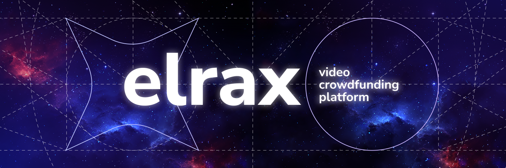
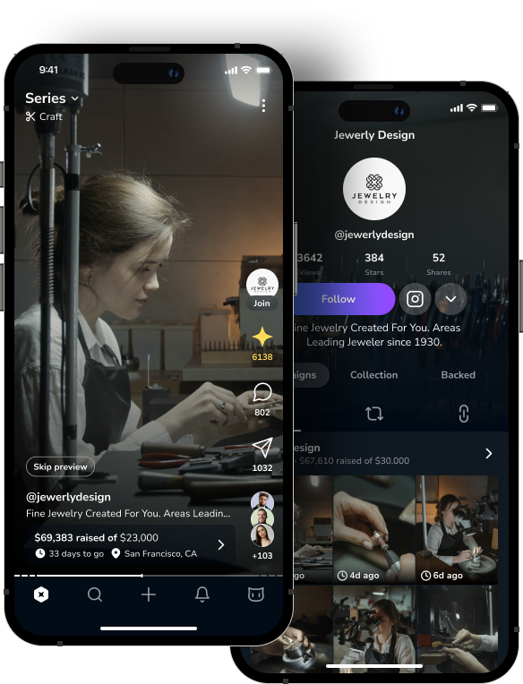

<a href="https://elrax.com">
	<picture>
		<source media="(prefers-color-scheme: dark)" srcset="./.github/assets/logo.dark.png?raw=true">
		<source media="(prefers-color-scheme: light)" srcset="./.github/assets/logo.light.png?raw=true">
		
	</picture>
<a>

   
   
   
   

We make crowdfunding **easy** and **enjoyable** for **everyone**.

	
	<a href="https://elrax.com">Website</a>
	·
	<a href="https://github.com/elrax/elrax/issues">Issues</a>
	·
	<a href="https://github.com/elrax/elrax">Github</a>

Elrax is an **open-source video platform** for **crowdfunding, progress tracking, and feedback collection**. Through it, we want to make a powerful push for crowdfunding to become even more popular in the world.

We aim to create an application that will become standard for users on a par with YouTube, Instagram, and TikTok. But unlike them, we will promote our **"Don't just watch, but participate"** approach. Each visit, whether short or long, will count and give users the feeling that they are part of something bigger, something important to them, society, or nature.

## Core features

-   **Video crowdfunding:** Video content is the core of our platform. Users can quickly find interesting projects and have fun at the same time.
-   **Advanced user profile:** We value backers just as much as project creators. That's why every user of our platform has a public profile, with statistics, donation history and a gallery of earned rewards.
-   **Open-source:** Together, we can transform the world for the better! We believe that ultimate crowdfunding platform should be open-source in order to be fully consistent with its core altruistic nature.
-   **Development series:** Creators can publish videos of project development long before the start of crowdfunding campaign, thereby showing potential backers that the project is trustworthy.
-   **User participation:** Not only project creators, but all users can publish videos on the platform to express their opinion, give useful advice, or participate in competitions and events.
-   **Voting:** Users can influence projects by participating in key decisions while contributing funds. This helps project creators to be on the same page with their backers.

## App design

The user interface of our app is still under development, but we can already show you some recent screenshots of it.

## Contributing

Please see our [contributing guide](./CONTRIBUTING.md).

Elrax is **free, open-source software** licensed under [AGPL-3.0-only license](./LICENSE).

You can [open issues](https://github.com/elrax/elrax/issues) for **bugs** you've found or **features** you think are missing. You can also submit pull requests to this repository or submit translations using [Crowdin](https://crowdin.com/project/elrax).

## License

Copyright (c) 2023 Elrax Corp.

This program is free software: you can redistribute it and/or modify it under the terms of the GNU Affero General Public License as published by the Free Software Foundation, version 3 only.

This program is distributed in the hope that it will be useful, but WITHOUT ANY WARRANTY; without even the implied warranty of MERCHANTABILITY or FITNESS FOR A PARTICULAR PURPOSE. See the GNU Affero General Public License for more details.

You should have received a copy of the GNU Affero General Public License along with this program. If not, see <https://www.gnu.org/licenses/>.
